# Daily Reflection Tree — Visual Diagram

```mermaid
flowchart TD
    START([START\nGood evening...]) --> A1_OPEN

    A1_OPEN{A1_OPEN\nOne word for today?\nProductive / Tough / Mixed / Frustrating}
    A1_OPEN --> A1_D1{A1_D1\nDecision}

    A1_D1 -->|Productive / Mixed| A1_Q_AGENCY_HIGH[A1_Q_AGENCY_HIGH\nWhat drove today going well?]
    A1_D1 -->|Tough / Frustrating| A1_Q_AGENCY_LOW[A1_Q_AGENCY_LOW\nFirst instinct when things got hard?]

    A1_Q_AGENCY_HIGH -->|prepared / adapted → internal| A1_D2{A1_D2\nAxis1 dominant?}
    A1_Q_AGENCY_HIGH -->|team / unsure → external| A1_D2
    A1_Q_AGENCY_LOW  -->|control / push → internal| A1_D2
    A1_Q_AGENCY_LOW  -->|wait / stuck → external| A1_D2

    A1_D2 -->|internal| A1_Q_CHOICE[A1_Q_CHOICE\nWhat guided your decisions?]
    A1_D2 -->|external| A1_Q_MOMENT[A1_Q_MOMENT\nAny small choice in that hard moment?]

    A1_Q_CHOICE -->|judgment/situation → internal| A1_D3{A1_D3\nAxis1 final}
    A1_Q_CHOICE -->|others_rx/avoided → external| A1_D3
    A1_Q_MOMENT -->|yes_see/maybe → internal| A1_D3
    A1_Q_MOMENT -->|no/new_frame → external| A1_D3

    A1_D3 -->|internal| A1_R_INTERNAL[/A1_R_INTERNAL\nYou moved with agency today/]
    A1_D3 -->|external| A1_R_EXTERNAL[/A1_R_EXTERNAL\nTough days pull attention outward/]

    A1_R_INTERNAL --> BRIDGE_1_2
    A1_R_EXTERNAL --> BRIDGE_1_2

    BRIDGE_1_2([BRIDGE 1→2\nNow — what did you give?]) --> A2_OPEN

    A2_OPEN{A2_OPEN\nBest-fit interaction today?\nHelped / Unrecognised / Extra / Others slack}
    A2_OPEN --> A2_D1{A2_D1\nAxis2 dominant?}

    A2_D1 -->|contribution| A2_Q_CONTRIB[A2_Q_CONTRIB\nWhat drove the extra effort?]
    A2_D1 -->|entitlement| A2_Q_ENTITLE[A2_Q_ENTITLE\nWhat did you do with that feeling?]

    A2_Q_CONTRIB -->|right/need/habit → contribution| A2_D2{A2_D2\nAxis2 final}
    A2_Q_CONTRIB -->|noticed → entitlement| A2_D2
    A2_Q_ENTITLE -->|let_go/voiced → contribution| A2_D2
    A2_Q_ENTITLE -->|held/withdrew → entitlement| A2_D2

    A2_D2 -->|contribution| A2_R_CONTRIB[/A2_R_CONTRIB\nYou were in giving mode today/]
    A2_D2 -->|entitlement| A2_R_ENTITLE[/A2_R_ENTITLE\nWas today about receiving or giving?/]

    A2_R_CONTRIB --> BRIDGE_2_3
    A2_R_ENTITLE --> BRIDGE_2_3

    BRIDGE_2_3([BRIDGE 2→3\nHow wide was your view?]) --> A3_OPEN

    A3_OPEN{A3_OPEN\nWho came to mind during today's challenge?\nSelf / Team / Colleague / End user}
    A3_OPEN --> A3_D1{A3_D1\nAxis3 dominant?}

    A3_D1 -->|altrocentric| A3_Q_PERSPECTIVE[A3_Q_PERSPECTIVE\nDid that awareness change your actions?]
    A3_D1 -->|self_centric| A3_Q_NARROW[A3_Q_NARROW\nWas anyone else struggling near you?]

    A3_Q_PERSPECTIVE -->|changed/helped → altrocentric| A3_D2{A3_D2\nAxis3 final}
    A3_Q_PERSPECTIVE -->|thought/noted → self_centric| A3_D2
    A3_Q_NARROW -->|noticed → altrocentric| A3_D2
    A3_Q_NARROW -->|heads_down/new_awareness → self_centric| A3_D2

    A3_D2 -->|altrocentric| A3_R_ALTRO[/A3_R_ALTRO\nYou looked up and saw others/]
    A3_D2 -->|self_centric| A3_R_SELF[/A3_R_SELF\nTomorrow — notice one person/]

    A3_R_ALTRO --> SUMMARY
    A3_R_SELF  --> SUMMARY

    SUMMARY[SUMMARY\nYou described today as X.\nAxis1: Y  Axis2: Z  Axis3: W\n+ personalised reflection] --> END

    END([END\nSee you tomorrow.])

    style START fill:#2d6a4f,color:#fff
    style END fill:#2d6a4f,color:#fff
    style BRIDGE_1_2 fill:#52b788,color:#fff
    style BRIDGE_2_3 fill:#52b788,color:#fff
    style SUMMARY fill:#1b4332,color:#fff
    style A1_R_INTERNAL fill:#74c69d,color:#000
    style A1_R_EXTERNAL fill:#74c69d,color:#000
    style A2_R_CONTRIB fill:#74c69d,color:#000
    style A2_R_ENTITLE fill:#74c69d,color:#000
    style A3_R_ALTRO fill:#74c69d,color:#000
    style A3_R_SELF fill:#74c69d,color:#000
```

## Node Count Summary

| Type        | Count | Nodes |
|-------------|-------|-------|
| start       | 1     | START |
| question    | 9     | A1_OPEN, A1_Q_AGENCY_HIGH, A1_Q_AGENCY_LOW, A1_Q_CHOICE, A1_Q_MOMENT, A2_OPEN, A2_Q_CONTRIB, A2_Q_ENTITLE, A3_OPEN, A3_Q_PERSPECTIVE, A3_Q_NARROW |
| decision    | 6     | A1_D1, A1_D2, A1_D3, A2_D1, A2_D2, A3_D1, A3_D2 |
| reflection  | 6     | A1_R_INTERNAL, A1_R_EXTERNAL, A2_R_CONTRIB, A2_R_ENTITLE, A3_R_ALTRO, A3_R_SELF |
| bridge      | 2     | BRIDGE_1_2, BRIDGE_2_3 |
| summary     | 1     | SUMMARY |
| end         | 1     | END |
| **Total**   | **28**|       |

## All Possible Paths (8 unique journeys)

Every conversation goes through exactly:
- 1 START → 1 opening question → 2 branching questions per axis → 1 reflection per axis → 1 SUMMARY → END

The 8 unique end states (one per combination of axis outcomes):

1. internal + contribution + altrocentric
2. internal + contribution + self_centric  
3. internal + entitlement + altrocentric
4. internal + entitlement + self_centric
5. external + contribution + altrocentric
6. external + contribution + self_centric
7. external + entitlement + altrocentric
8. external + entitlement + self_centric
